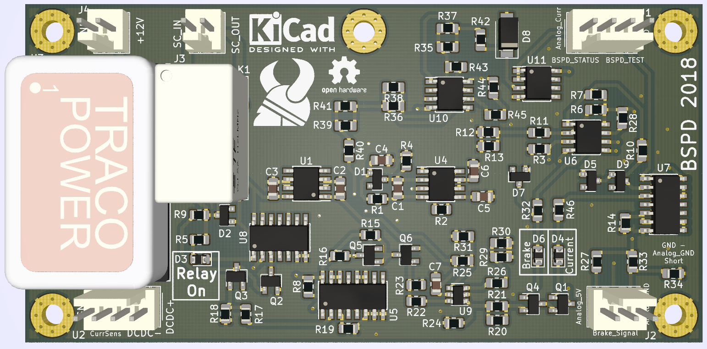

# BSPD
Formula Student -- Brake System Plausibility Device

# Brake System Plausibility Device 

Formula Student  
Ruleset: FS-Rules_2018_V1.1  
This BSPD passed scrutineering at Formula Student UK 2018  
Please let us know if you used this design for your car or if you have used it and made useful improvements to it  
Also if you have any questions please let us know --> [SDU-Vikings](https://www.facebook.com/SDUVikings/?hc_ref=ARTjX442SZMKwcmNnhHa4KYyQpRgB5dD4x-7G2Z0j-hZw_FMgdILzyK0XDBPWNJGz00)



## Schematic and PCB

The project is made in KiCad. Get it here --> [KiCad 5.0](http://kicad-pcb.org/download/)  
The schematic layout and PCB layout is found in the ``KiCad/`` subfolder.

## Components

The design is made for a battery supply of between 11 V and 15 V.   
The current consumption is measured at between 63,0 and 90,3 mA with a 12,7 V supply.

For current measurement [LEM HAS 100-S](https://export.rsdelivers.com/product/lem/has-100s/lem-has-series-open-loop-current-sensor-300a/3019495) is used. The Hall Effect Sensor needs +-15 V supply hence the [TEN 8-1223](https://export.rsdelivers.com/product/tracopower/ten-8-1223/tracopower-ten-8-8w-isolated-dc-dc-converter/4239628).  
For brake presssure measurement [EPT3100](https://www.variohm.com/images/datasheets/EPT3100_Pressure_Sensor_1608_T.pdf) is used.  
The relay for the safety chain is [TE-OJ-SS-112LMH2](https://export.rsdelivers.com/product/te-connectivity/oj-ss-112lmh2005/te-connectivity-spno-non-latching-relay-pcb-mount/6802518).

### Debugging LED's

The design includes SMD-sized LED's for easier debugging. **D3** and **D4** can be removed altogether and **D6** replaced by an ordinary P/N-diode.

### Delay-block

[LTC6994](https://export.rsdelivers.com/product/linear-technology/ltc6994is6-1trmpbf/linear-technology-ltc6994is6-1trmpbf-programmable/8580894) is as delay-block. The delay-block is configured for a delay of 500 ms. See [LTC6994 One Shot](http://beta-tools.analog.com/timerblox/LTC6994) to configure delay and use ``LTC6994.json`` for the setup.

### Latch and latch-reset

The signal from the delay-block is received by a latch [CD4043B](https://export.rsdelivers.com/product/texas-instruments/cd4043bd/texas-instruments-cd4043bd-quad-latch-transparent/6607616) that will latch on to the signal requiring power cycling of the low voltage system to reset it again.  
However the latch will latch on to a high signal when the low voltage system is turned on initially. The 555-circuit is used for generating a pulse, that will reset the latch. The pulse has a delay of approximately 500 ms at turn on. 

## Input signals and voltage dividers

### Current

HAS_100-S has a output voltage range of -12V to +12V with a voltage signal of 4 V for every 100 A in the wire.   
With a nominal battery voltage of 510,6 V the current to the motors at 9,8 A is below 5 kW as required by EV7.5.5 in the rules.  
```math
510,6 \,\mathrm{V} \cdot 9,7 \,\mathrm{A} \approx 4.953 \,\mathrm{W} 
```

At this current in the HV-wires the voltage output from the hall effect sensor is 0,388 V.  
The voltage divider between **R6** and **R11+R12||R13** gives a voltage treshold of 0,380, which corresponds to a current of 9,5 A in the wires.

```math
\frac{2600}{100000 + 2600} \cdot 15\, \mathrm{V} \approx 0,380\, \mathrm{V}
```

Change the value of **R6**, **R11**, **R12** and **R13** to adjust the voltage treshold of the comparator.

### Brake

Change the value of **R27** and **R33** to adjust the voltage treshold of the comparator for the brake pressure sensor.

## Current Measurement

The design includes operational amplifiers whose purpose is to convert the voltage range of the hall effect sensor signal from (-12V/+12V) to (0V/10V) for interfacing with a controller.  
It is not required for the intended functionality of the BSPD and can be removed.

**U10B** is a summation operational amplifier. The gain on the current sensor output is -5/24. This is summed to a voltage of -2,5 V converting the voltage range to (-5 V/0V). **U10A** has a gain of -2 converting the voltage range to the desired (0V/10V). **U11A** is a buffer.

## Labels in the schematic

``DCDC+``           +15 V  
``DCDC-``           -15 V  
``BSPD_TEST``       - Signal from controller to simulate 5 kW drawn from the battery pack  
``BSPD_STATUS``     - Signal to controller to show BSPD status. High when there is a BSPD fault  
``SC_IN``           - Safety chain in  
``SC_OUT``          - Safety chain out  
``Latch_Reset``     - From 555-timer-circuit. Used to pulse reset the latch   
``Current_Sensor``  - Voltage signal from LEM HAS 100-S  
``Brake_Sensor``    - Voltage signal from EPT3100  
``Analog_GND``      - Supplied GND to EPT3100. This is shorted to GND at the controller  
``Analog_5V``       - 5 V supplied to EPT3100
